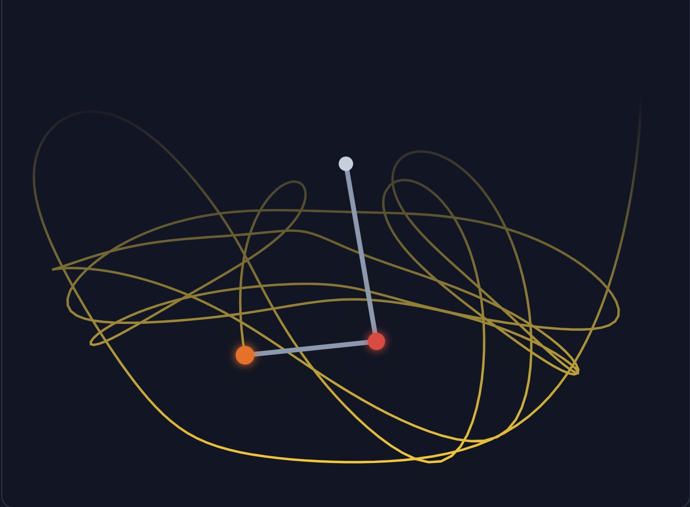

# N-Pendulum Simulator

An interactive and visually appealing N-pendulum simulator built with React and TypeScript, demonstrating the chaotic nature of multi-pendulum systems. This project runs entirely in the browser without any build steps, thanks to ES modules and CDN-hosted dependencies.



## ✨ Features

- **N-Pendulum System:** Simulate anything from a single simple pendulum to a complex 7-pendulum system.
- **Interactive Controls:** Adjust the mass and length of each pendulum, gravity, and initial angles in real-time.
- **Chaotic Motion Visualization:** Observe the sensitive dependence on initial conditions that defines chaotic systems.
- **Start/Pause/Reset:** Full control over the simulation flow.
- **Randomize:** Instantly generate a new random pendulum system to explore different configurations.
- **Visual Toggles:** Show or hide the pendulum rods and the trace path of the final bob.
- **Aesthetic UI:** A clean, modern, and responsive user interface built with Tailwind CSS.
- **Zero Build Setup:** Runs directly in the browser. Just open `index.html`!

## 🚀 How to Run

Since this project uses ES modules (`type="module"`), it needs to be served by a web server to handle module imports correctly. You cannot simply open the `index.html` file from your local filesystem.

1.  **Clone the repository:**
    ```bash
    git clone <repository-url>
    cd <repository-directory>
    ```

2.  **Start a local web server:**
    If you have Python installed, you can run one of the following commands in the project's root directory:

    *For Python 3:*
    ```bash
    python -m http.server
    ```
    *For Python 2:*
    ```bash
    python -m SimpleHTTPServer
    ```
    Alternatively, you can use any other simple web server or a VS Code extension like [Live Server](https://marketplace.visualstudio.com/items?itemName=ritwickdey.LiveServer).

3.  **Open in your browser:**
    Navigate to the URL provided by your local server (e.g., `http://localhost:8000`).

## 🛠️ Tech Stack

- **React 19:** For building the user interface.
- **TypeScript:** For type safety.
- **Tailwind CSS:** For styling.
- **No Build Tools:** Dependencies are loaded directly from CDNs (`esm.sh`) using ES Import Maps.

## 📄 License

This project is licensed under the MIT License. See the [LICENSE](./LICENSE) file for details.
